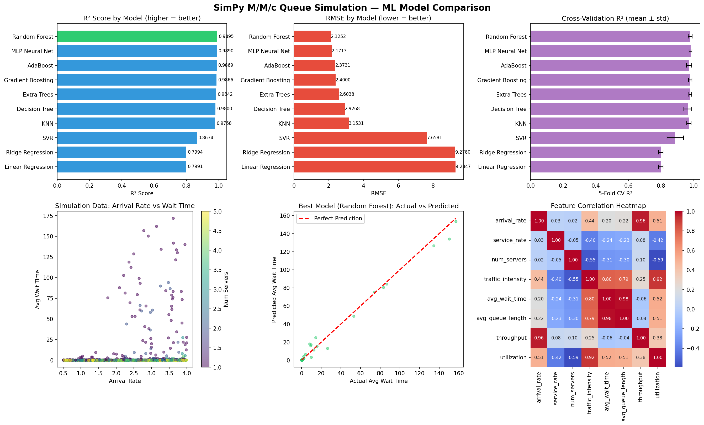

# Data Generation using Modelling & Simulation for Machine Learning

> **Assignment**: Generate synthetic data via simulation, then train and compare ML models on it.

---

## Table of Contents
1. [Overview](#overview)
2. [Simulation Tool: SimPy](#simulation-tool-simpy)
3. [M/M/c Queue Model](#mmc-queue-model)
4. [Parameters & Bounds](#parameters--bounds)
5. [Methodology](#methodology)
6. [Results Table](#results-table)
7. [Result Graphs](#result-graphs)
8. [Conclusion](#conclusion)
9. [How to Run](#how-to-run)

---

## Overview

This project demonstrates a complete **Simulation → Data Collection → Machine Learning** pipeline:

1. A real-world **queuing system** (e.g., a bank, hospital, call center) is modelled using SimPy
2. **1,000 unique simulations** are run with randomly sampled parameters
3. **10 ML regression models** are trained to predict average customer wait time
4. Models are compared across RMSE, MAE, R², and Cross-Validation metrics

**ML Task**: Predict `avg_wait_time` (the mean time a customer waits before service begins) given queue configuration parameters.

---

## Simulation Tool: SimPy

| Property | Detail |
|----------|--------|
| **Name** | SimPy |
| **Type** | Discrete-Event Simulation (DES) |
| **Language** | Python |
| **Install** | `pip install simpy` |
| **Documentation** | https://simpy.readthedocs.io/ |
| **Wikipedia** | https://en.wikipedia.org/wiki/SimPy |

SimPy is a process-based discrete-event simulation library. It allows you to model real-world systems where entities (customers, packets, jobs) arrive, wait in queues, consume resources (servers, machines, bandwidth), and depart.

**Why SimPy?**
- Pure Python, easy to install and use
- Widely used in operations research, logistics, healthcare, and network modelling
- Supports complex conditional logic (priority queues, reneging, preemption)
- Validated against analytical queueing theory results

---


## Methodology

### Step 1–2: Install & Explore SimPy
```python
!pip install simpy
import simpy
env = simpy.Environment()
server = simpy.Resource(env, capacity=2)
```

### Step 3: Parameter Sampling
Each simulation draws parameters uniformly at random:
```python
arrival_rate = np.random.uniform(0.5, 4.0)   # λ
service_rate = np.random.uniform(1.0, 5.0)   # μ
num_servers  = np.random.randint(1, 6)        # c ∈ {1,2,3,4,5}
```

### Step 4: SimPy Simulation Function
```python
def run_mmc_simulation(arrival_rate, service_rate, num_servers, sim_time=500):
    env = simpy.Environment()
    server = simpy.Resource(env, capacity=num_servers)
    wait_times, queue_lengths = [], []

    def customer(env, arrival_time):
        with server.request() as req:
            yield req
            wait_times.append(env.now - arrival_time)
            yield env.timeout(np.random.exponential(1.0 / service_rate))

    def generator(env):
        while True:
            yield env.timeout(np.random.exponential(1.0 / arrival_rate))
            queue_lengths.append(len(server.queue))
            env.process(customer(env, env.now))

    env.process(generator(env))
    env.run(until=sim_time)
    return np.mean(wait_times), np.mean(queue_lengths), ...
```

### Step 5: 1000 Simulations
```python
for i in range(1000):
    arr, svc, svrs = sample_random_params()
    results = run_mmc_simulation(arr, svc, svrs, sim_time=500)
    records.append({params + results})
df = pd.DataFrame(records)  # Shape: (1000, 8)
```

### Step 6: ML Pipeline
- **Split**: 80% train, 20% test
- **Scaling**: StandardScaler applied for distance/gradient-based models
- **Models**: 10 models trained and evaluated
- **Evaluation**: RMSE, MAE, R², 5-Fold CV R²

---

## Results Table

### ML Model Performance Comparison

| Rank | Model | RMSE ↓ | MAE ↓ | R² ↑ | CV R² (mean) | CV R² (std) |
|------|-------|--------|-------|------|--------------|-------------|
| 1 | **Random Forest** | **2.1252** | **0.5114** | **0.9895** | 0.9786 | 0.0117 |
| 2 | MLP Neural Net | 2.1713 | 0.7143 | 0.9890 | 0.9807 | 0.0090 |
| 3 | Gradient Boosting | 2.4000 | 0.6179 | 0.9866 | 0.9789 | 0.0105 |
| 4 | AdaBoost | 2.3731 | 0.8892 | 0.9869 | 0.9720 | 0.0157 |
| 5 | Extra Trees | 2.6038 | 0.6246 | 0.9842 | 0.9789 | 0.0093 |
| 6 | Decision Tree | 2.9268 | 0.7459 | 0.9800 | 0.9640 | 0.0241 |
| 7 | KNN | 3.1531 | 0.7275 | 0.9768 | 0.9704 | 0.0138 |
| 8 | SVR | 7.6581 | 1.4315 | 0.8634 | 0.8868 | 0.0505 |
| 9 | Ridge Regression | 9.2780 | 6.8734 | 0.7994 | 0.7986 | 0.0141 |
| 10 | Linear Regression | 9.2847 | 6.9105 | 0.7991 | 0.7985 | 0.0140 |

**Bold** = Best value in each metric column.

---

## Result Graphs

### Dashboard Overview


### Dependencies

| Package | Version | Purpose |
|---------|---------|---------|
| simpy | ≥ 4.0 | Discrete-event simulation |
| numpy | ≥ 1.21 | Numerical computing |
| pandas | ≥ 1.3 | Data management |
| matplotlib | ≥ 3.4 | Plotting |
| seaborn | ≥ 0.11 | Statistical visualization |
| scikit-learn | ≥ 1.0 | Machine learning models |

---

## Files

```
├── SimPy_ML_Assignment.ipynb   # Main Colab notebook
├── simulation_data.csv          # 1000 simulation records
├── ml_model_results.csv         # ML model comparison table
├── results_dashboard.png        # Results visualization
└── README.md                    # This file
```

---

*Assignment: Data Generation using Modelling and Simulation for Machine Learning*
